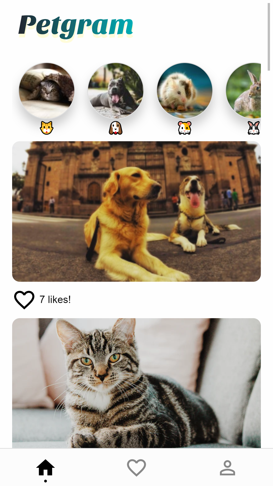

# App de Podcast

App donde podras ver las fotos de nuestras mascotas

## Como funciona?

Requiere Node.js 10 o mayor

* `npm install` para instalar las dependencias.
* `npm run dev` para el entorno de desarrollo.
* `vercel-build && serve:dev` para el entorno de produccion.

## Demo

https://petgram-ten.vercel.app/

## Licencia

MIT
